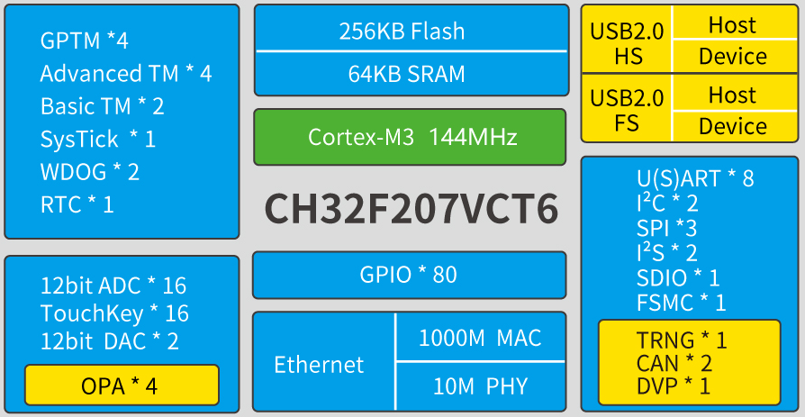

# [CH32F207](https://github.com/SoCXin/CH32F207)

* [WCH](http://www.wch.cn/)：[Cortex-M3](https://github.com/SoCXin/Cortex-M3)
* [L4R4](https://github.com/SoCXin/Level)：144 MHz

## [简介](https://github.com/SoCXin/CH32F207/wiki)

[CH32F207](https://github.com/SoCXin/CH32F207) 系列是基于Cortex-M3内核设计的工业级互联型微控制器，此系列主频高达144MHz，独立了GPIO电压（与系统供电分离）。资源同比增加了随机数单元，4组运放比较器；提高串口U(S)ART数量到8组，电机定时器到4组。搭配时钟安全、电源管理、双组DMA、DAC、SDIO、CAN、FSMC等资源。提供USB2.0高速接口（480Mbps）并内置了PHY收发器，以太网MAC升级到千兆并集成了10M-PHY模块。

#### 关键特性

* 千兆以太网控制器ETH（内置10M PHY）
* SDIO接口、FSMC接口、DVP数字图像接口
* USB2.0高速主机/设备接口（480Mbps 内置PHY）
* 3个USART接口和5个UART接口
* 2个CAN接口（2.0B主动）

### [资源收录](https://github.com/SoCXin)

* [参考资源](src/)
* [参考文档](docs/)
* [参考工程](project/)
* [入门文档](https://docs.soc.xin/CH32F207)

### [选型建议](https://github.com/SoCXin)

### [探索芯世界 www.SoC.xin](http://www.SoC.Xin)
