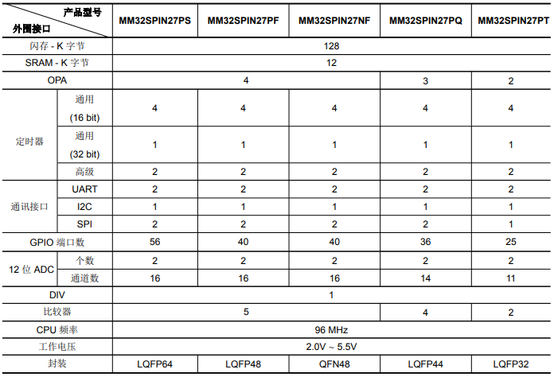

# [MM32SPIN27](https://github.com/SoCXin/MM32SPIN27) 

 

#### [Vendor](https://github.com/SoCXin/Vendor)：[MindMotion](http://www.mm32.com.cn/)
#### [Core](https://github.com/SoCXin/Cortex)：[Cortex M0](https://github.com/SoCXin/CM0) 
#### [Level](https://github.com/SoCXin/Level)：72MHz 

## [描述](https://github.com/SoCXin/MM32SPIN27/wiki) 

[MM32SPIN27](https://github.com/SoCXin/MM32SPIN27) 

 

### [资源收录](https://github.com/SoCXin/MM32SPIN27)

* [文档](docs/)
* [资源](src/)

### [选型建议](https://github.com/SoCXin)

[MM32SPIN27](https://github.com/SoCXin/MM32SPIN27) 

###  [SoC芯平台](http://SoC.Xin) 
